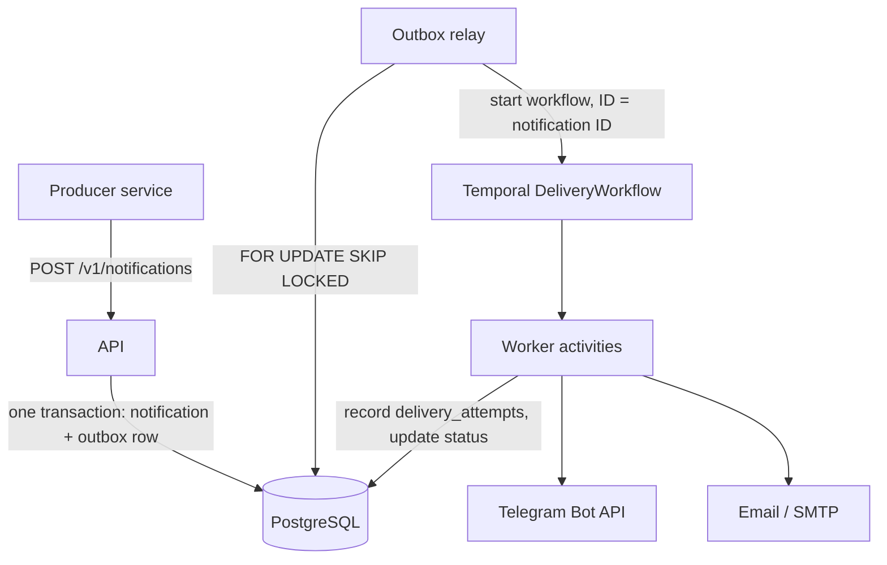

# notification-service

A reliable notification delivery service in Go. Other systems hand it an event over HTTP; it guarantees delivery through one or more channels — with retries, idempotency, and a full per-attempt audit trail.

Built on the patterns I run in production at a digital bank: **transactional outbox** on PostgreSQL and **Temporal** for delivery orchestration.

**Stack:** Go · PostgreSQL (pgx/v5, no ORM) · Temporal · stdlib `net/http` · Docker Compose · GitHub Actions

## Architecture



Status lifecycle: `pending → processing → delivered | failed`.

## Design decisions

**Why a transactional outbox?** Two reasons. First, **availability**: the API's only hard dependency is Postgres. If Temporal is down, we keep accepting and collecting notifications; when it comes back up, the relay drains the backlog automatically — nothing is lost and nothing is resent by hand. Second, **atomicity**: the API must both persist the notification and trigger processing, and there is no way to do that atomically across two systems. So we don't try — the notification row and the outbox row are written in one Postgres transaction, and a separate relay performs the second step.

**Why Temporal instead of a hand-rolled queue worker?** A plain worker gives you a loop; Temporal gives you durable timers, automatic retries with backoff, deduplication by workflow ID, and a complete execution history you can open in a UI when something goes wrong at 3 AM. Recreating even half of that on top of a queue means rebuilding Temporal badly. The outbox and Temporal are not redundant: the outbox protects the *intake* path (API ↔ Postgres), Temporal protects the *delivery* path (retries, state, visibility).

**Two layers of idempotency.** A client-supplied `idempotency_key` has a unique index — a duplicate request returns the original notification and writes no new outbox row. And the relay starts every workflow with `WorkflowID = notification ID`, so even if the relay crashes between starting a workflow and committing, the retried start is rejected by Temporal as a duplicate. No double sends from either direction.

**Why no ORM?** Plain SQL through pgx/v5 keeps every query visible and reviewable. The outbox pattern depends on precise transaction control (`FOR UPDATE SKIP LOCKED`, partial indexes) — exactly the place where an ORM gets in the way.

**Why stdlib `net/http`?** At this scale the Go 1.22+ router does everything needed, with zero dependencies. (In production at work I use fasthttp where the throughput justifies it.)

## Quick start

```bash
# 1. Start Postgres, Temporal, Temporal UI and Mailpit
docker compose up -d postgres temporal temporal-ui mailpit

# 2. Apply migrations
make migrate

# 3. Start the service (api + relay + worker)
docker compose up -d --build api relay worker

# 4. Send a notification
curl -s -X POST localhost:8080/v1/notifications \
  -H 'Content-Type: application/json' \
  -d '{
    "idempotency_key": "demo-1",
    "channel": "email",
    "recipient": "you@example.com",
    "subject": "Hello from notification-service",
    "body": "First delivery!"
  }'
```

Then open:
- **Mailpit** — http://localhost:8025 — the delivered email
- **Temporal UI** — http://localhost:8233 — the `delivery-<id>` workflow with its full history

Send the same request twice and the response comes back with `"duplicate": true` — the second call delivers nothing.

Check status and the attempt history:

```bash
curl -s localhost:8080/v1/notifications/<id>
```

For Telegram delivery, set `TELEGRAM_BOT_TOKEN` (create a bot via [@BotFather](https://t.me/BotFather)) and use your chat ID as `recipient`.

## Project layout

```
cmd/
  api/        HTTP intake
  relay/      outbox poller → workflow starts
  worker/     Temporal workflow + activities
internal/
  api/        handlers, validation
  storage/    pgx repositories (notifications, outbox, delivery_attempts)
  outbox/     relay loop (FOR UPDATE SKIP LOCKED)
  workflow/   DeliveryWorkflow + activities
  channel/    Channel interface + telegram, email
  config/     env configuration
migrations/   goose SQL migrations
```

## Roadmap

- [x] Non-retryable error wiring (`temporal.NewNonRetryableApplicationError` for permanent failures)
- [x] Integration tests with testcontainers
- [ ] NATS intake as an alternative to HTTP
- [ ] Message templates
- [ ] Per-recipient rate limiting
- [ ] Prometheus metrics

## Author

Mijgona Azizzoda — [LinkedIn](https://www.linkedin.com/in/mijgona/) · [GitHub](https://github.com/mijgona)
